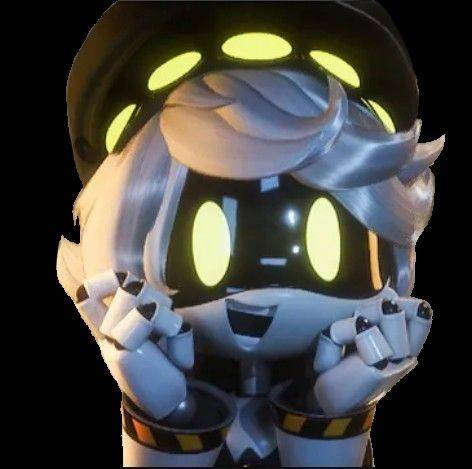
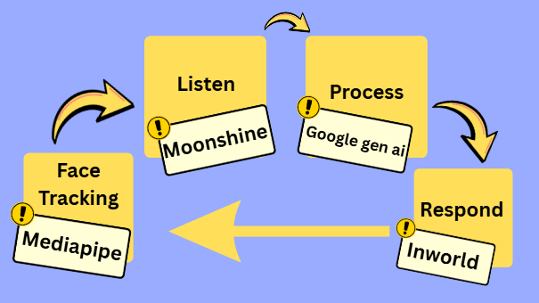
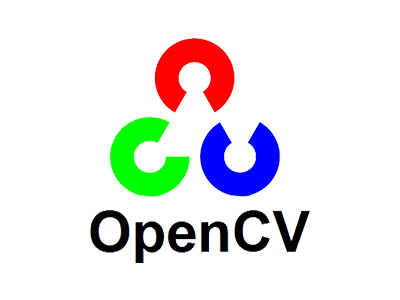
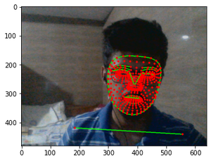
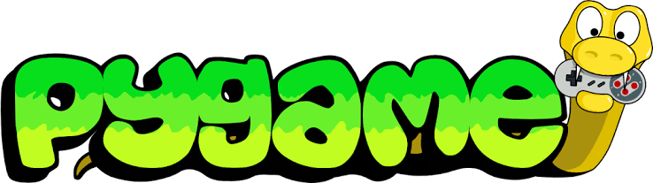
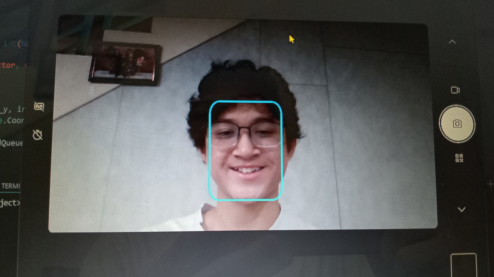
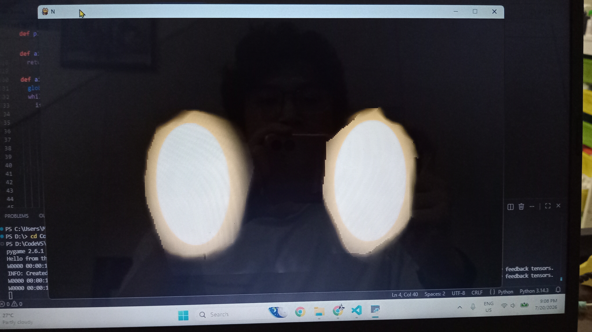
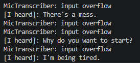
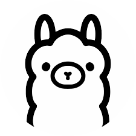
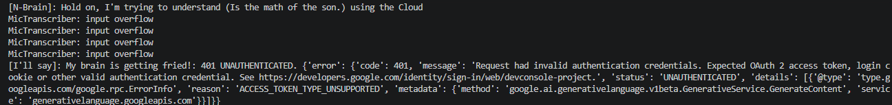

# N (Murder Drones), Prototype AI Companion
I had just finished watching the youtube series <b>Murder Drones</b> a month and a half prior to this. After watching someone making an AI companion based on <b>BMO</b> from <b>Adventure Time</b>, I got inspired to make my own with N as my inspiration. 

<i>N on left, video of AI on right</i>

I threaded and created the logic that allowed the different modules of the program to work with each other, but I leaned onto Gemini AI to help create some of the modules

## The process flow
I wanted this AI to do <b>2 things</b>:
- Be <b>voice activated</b>
- <b>Track my face</b>

Below is a process <b>flow chart</b> summarizing the loop the AI operates in

## Face Tracking
### Face Mesh
I followed some youtube tutorial guides on creating a face tracking program for N. I used <b>opencv</b> and <b>mediapipe</b> for that module. 

  
  

I used the face-tracking software to track the <b>position of my nose</b> in the coordinate system of my webcam. 

(I don't have footage of me testing it because I used the altered the code to make the program, so here's an image of what it looked like)

  

With this in place, I could now work in <b>translating those coordinates</b> onto a window using pygame to start the tracking

### The window
I used pygame to create a window to display the eyes on screen, and also to update its position based on the position of my nose on the webcam. 

  

After returning the coordinates of my nose from the <b>webcam</b>, I used an algorithm to convert that into the dimensions of the pygame window using <b>ratios</b>. I <b>dynamically updated</b> the position of the eyes to match the movement of my nose, and moved it at <b>60 fps</b> for smooth animation.

  
  

With that out of the way, face tracking was <b>completed</b>.

## Listening
After doing some research, I decided to use **Moonshine** as the **speech-to-text** model. I cycled through different versions of the model to accomodate for the processing power of my laptop, until I finally implemented a suitable one. 

  

I connected my earbuds to my laptop and used its **microphone** to run some tests, to which it returned my speech acceptably. There's still some problems with it, but I think it is mainly to do with my microphone, which is a problem I will delve more into later.

  

  <i>At the time, the microphone picked up a background conversation</i>

With the listening completed, I was halfway through the project. Now, onto **processing**.

## Processing
At first, I chose **ollama** to be the ai model to handle my questions. However, when I tried to load it onto my computer together with my program, it crashed my program with how big it was. No amount of threading or model de-scaling helped that. 

  
  

So, I had to pivot. I decided to use google's **gen ai** as the ai, as it would not require any processing power from my laptop. Instead, the processsing would be done in **servers** on google's system. However, I only have a **limited number of requests** I can make, which is another problem I want to address later. 

  
  

After designing the 'Brain' of N and directing my speech prompts to the ai, I finally had a responsive program that answered my questions, albeit in text form.

  

*Disclaimer: I might've ran out of tokens for the google gen ai from testing. My previous tests showed it responded properly.*

*Disclaimer 2: My microhpone quality was pretty bad. Instead of 'What's the mass of the sun', it detected 'is the math of son'.*

With processing completed, there was only one thing left to do: **Response**

## Response
To give N his voice, I used a **Inworld**, an website that allows me to generate text from speech. I used a pregenerated voice called **'young robot'** because I didn't want to steal **Micahel Kovach's**--the voice actor of N--work. 

  

I also made it take prompts only after I say **'Hello' or 'Hey'** to prevent it from taking background noises as prompts

*Side-note: I have lots of pregenerated messages for N in the 'Preset Messages' folder. You can listen to them by going on this [link](https://github.com/ArifNaufalMNazri/Prototype-AI-Companion-based-on-N-from-Murder-Drones/tree/main/Preset%20Messages)*

And on that note, the project was **completed!**

  

# Final Results

  

It can see me, it can follow me, and most of all, it can **listen and talk back to me!**(Until I run out of tokens, which I have for now)

## Problems
There are still a couple of problems with N:
- Limited tokens means I've got to wait a long while to talk to him
- Poor microphone quality means N mishears some words, even if I upgrade the model

### Solutions 
- I'm thinking of porting him to a **raspberry pi** to make him a robot and so I can load the **ollama ai model** to use instead of relying on tokens
- I want to use a different **voice detection model** so, again, I don't rely on tokens
- I want to get a **better microphone** so N can hear me better

## Parting thoughts
This was my first real delve into programming something with **AI**. I may have used **Gemini AI** to help code some of the models, but I'm glad to have learned so much about it. Maybe one day I'll make another, better one. One with better hardware and entirely my own code; maybe I'll come back and upgrade this one. Either way, that's a challenge for **Future Me**.
